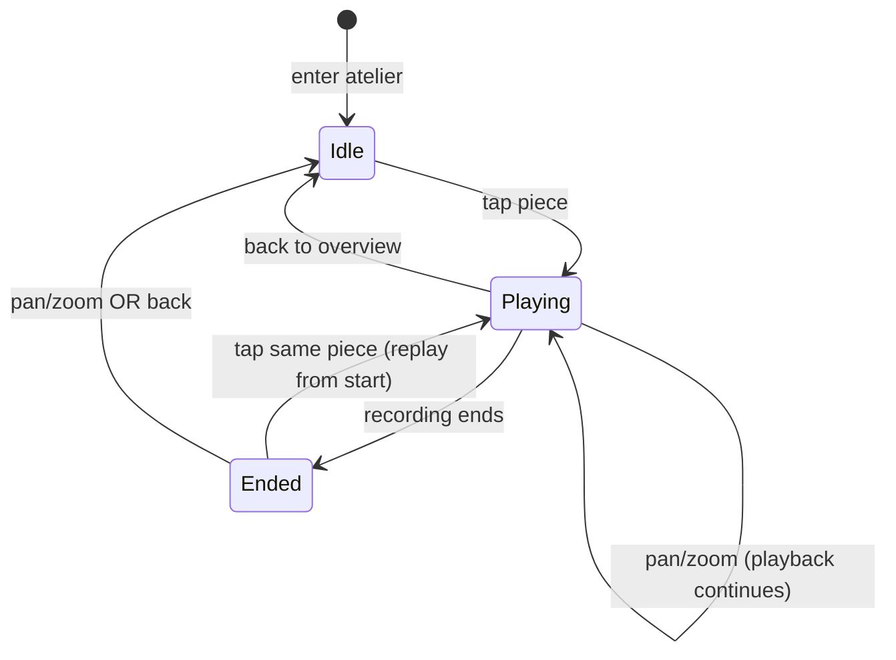

# Explicit listen — audio design

**Status:** phases 1–3 shipped (2026-07-03)  
**Supersedes:** proximity-driven “solo-near” playback (`spatial-mix`, `spatial-audio-loop`, `audio-engine`)

This document defines audio and listening UI behaviour for the atelier.

---

## Artistic intent

Each drawing with an HMV plaque has **one finite recording** — a performance with a beginning and an end, paired with that work.


| Principle            | Meaning for the visitor                                              |
| -------------------- | -------------------------------------------------------------------- |
| **Discovery**        | The desk is explored by panning and zooming; music is not wallpaper. |
| **Attention**        | Tap a piece to look closely **and** to put that record on.           |
| **Once through**     | The recording plays to the end, then stops.                          |
| **Replay by choice** | Tap the same piece again after `ended` to hear it from the start.    |
| **One voice**        | Only one piece is “on the gramophone” at a time.                     |


The door is a threshold: entering the atelier is silent (fit-all overview). Sound follows **intent** (tap), not viewport position.

---

## Architecture (shipped)

```
+page.svelte
  └── createAtelierSession()
        ├── view / gestures / prefetch
        ├── listening.svelte.ts     — tap focus + HUD session
        └── audio-player.svelte.ts  — one <audio> + gain; crossfade on switch/stop
```

Door (`+page.svelte`):

```ts
initAudio();
await prepareContext(); // AudioContext unlock only — no track priming
```

### `listening.svelte.ts`

- `listening: { drawingId, phase: 'playing' | 'ended' } | null` (via `drawingId` + `phase`)
- `focus(drawingId)` — tap: sets session + `focusedId` for view transition
- `markEnded()` — from `audio.ended`
- `clear()` — back to overview / dismiss ended HUD on pan
- Getters: `focusedId`, `hudDrawingId`, `hudEnded`, `isPlaying(id)`

### `audio-player.svelte.ts`

- Singleton `AudioContext` (door → atelier survives navigation)
- **One** `HTMLAudioElement` + `MediaElementSource` + gain (+ panner)
- `prepareContext()` — resume + inaudible blip
- `playDrawing(drawingId, { fromStart? })` — gesture-owned `play()`; crossfade; resume per drawing
- `stop({ fadeMs, reset? })` — fade out + pause; preserves resume position unless `reset`
- `playGeneration` — invalidates stale `loadedmetadata` handlers on rapid switch

---

## State machine



**Invariants**

- At most one `drawingId` in `listening` at a time.
- `play()` only from **tap handler** (door unlocks context only).
- No RAF or proximity `play()`.
- **Resume:** tap same piece while playing → no rewind; switch piece → resume saved position; back → pause but keep position.
- **Replay:** only when `phase === 'ended'` (`fromStart: true`).

---

## Visitor flows

### Enter atelier

1. Door click → `prepareContext()`.
2. Navigate → fit-all overview, **silent**.
3. HUD hidden; plaques dim.

### Tap a piece with audio

1. Focus animation.
2. `listening.focus(id)` → `phase: 'playing'`.
3. `playDrawing(id)` — load/swap track, resume or start, `play()` in gesture.
4. HUD + singing plaque on that piece only.

### During playback

- Pan/zoom **does not** stop playback — the gramophone stays on until the recording ends or the visitor uses back.
- Focus animation does not stop playback.

### Recording ends

1. `ended` → `markEnded()` → `phase: 'ended'`.
2. Audio silent; HUD stays (finished styling); plaque dims.

### Tap same piece

| State    | Behaviour                                      |
| -------- | ---------------------------------------------- |
| Playing  | Re-focus view only; **resume position** kept   |
| Ended    | Replay from start (`fromStart`)                |
| After back | Resume from saved position                 |

### Tap a different piece

- Crossfade (~300ms); swap `src`; resume that piece’s saved position (or start).

### Pan / zoom

| State   | Behaviour                          |
| ------- | ---------------------------------- |
| Playing | Playback **continues**             |
| Ended   | `listening.clear()` — HUD hides    |

### Back to overview

- `stop({ fadeMs })` — fade out, pause, **preserve resume position**
- `listening.clear()`
- Fit-all animation

---

## UI binding

| UI                | Rule                                                          |
| ----------------- | ------------------------------------------------------------- |
| **NearCue (HUD)** | Visible when `listening.drawingId !== null`                   |
| **HMV plaque**    | `piece__hmv--singing` only when `isPlaying(id)`               |
| **View transition** | `listening.focusedId`                                       |
| **`aria-pressed`** | `isPlaying(drawing.id)`                                      |

---

## Gestures (shipped)

| Event         | Behaviour                                                |
| ------------- | -------------------------------------------------------- |
| `pointerdown` | Prefetch tapped piece only — no audio unlock lists       |
| `wheel` / pan | `onExplore` — clear ended HUD only                       |
| Tap piece     | `listening.focus` + `playDrawing`                        |
| Back / Escape | `stop` + `listening.clear` + overview                    |

---

## Removed (phase 3)

| Removed | File |
| ------- | ---- |
| Proximity mix, RAF audio, solo-near engine | `spatial-mix.ts`, `spatial-audio-loop.svelte.ts`, `audio-engine.svelte.ts` |
| Tap pin module | `piece-focus.svelte.ts` (→ `listening.svelte.ts`) |
| `unlock(primeIds)`, `primedIndices`, `applyMix` → `play()` | — |
| `onGestureAudio` on pan/wheel/pointerdown | — |

---

## Migration plan

### Phase 1 — Listening state + UI ✅

- [x] `listening.svelte.ts`
- [x] HUD + plaque wired to `listening`
- [x] `focusedId` / view transition

### Phase 2 — Single player ✅

- [x] `audio-player.svelte.ts` with gain crossfade (~300ms)
- [x] Tap → `playDrawing`; switch → crossfade; back → fade + stop
- [x] `ended` → `listening.markEnded()`
- [x] Door → `prepareContext()` only

### Phase 3 — Remove proximity stack ✅

- [x] Delete `spatial-mix.ts`, `spatial-audio-loop.svelte.ts`, `audio-engine.svelte.ts`
- [x] Remove `onGestureAudio` / unlock lists from gestures

### Phase 4 — Docs

- [ ] Update `CURSOR.md` audio bullet and file table
- [ ] Update `README.md` atelier description
- [ ] Close related `CODE-REVIEW.md` items

### Phase 5 — Cleanup

- [ ] Precompute `audioIndexForDrawing` map

---

## Testing checklist

Manual, on **Safari iOS**, **Chrome desktop**, **Chrome incognito**:

- [ ] Door → atelier → overview silent
- [ ] Tap maskers → plays; HUD + plaque active
- [ ] Listen to end → stops; finished HUD; **no** auto-restart
- [ ] Tap again after ended → replay from start
- [ ] Tap lachend while maskers playing → switches with crossfade
- [ ] Pan while playing → **music continues**
- [ ] Pan after ended → HUD hides
- [ ] Back while playing → fades out; re-tap → **resumes** (not rewind)
- [ ] Alternate maskers ↔ lachend ↔ back — no silent HUD/plaque mismatch
- [ ] Reload → clean state
- [ ] Door → atelier → first tap still works

---

## Decisions


| Question | Decision |
| -------- | -------- |
| **Discovery without tap** | HMV plaque is the hint; plaques dim until `playing`. |
| **Playback while panning** | **Continues** until recording ends or back to overview. |
| **HUD when ended** | Stays with finished styling until pan or back. |
| **Crossfade** | ~300ms on piece switch and back-stop. |
| **Resume vs replay** | Resume position on re-tap / switch / back; replay from start only after `ended`. |
| **`focusedId` vs listening** | Merged in `listening.svelte.ts`. |

---

## References

- `src/lib/atelier/listening.svelte.ts`, `audio-player.svelte.ts`, `atelier-session.svelte.ts`
- `CODE-REVIEW.md`, `CURSOR.md`
