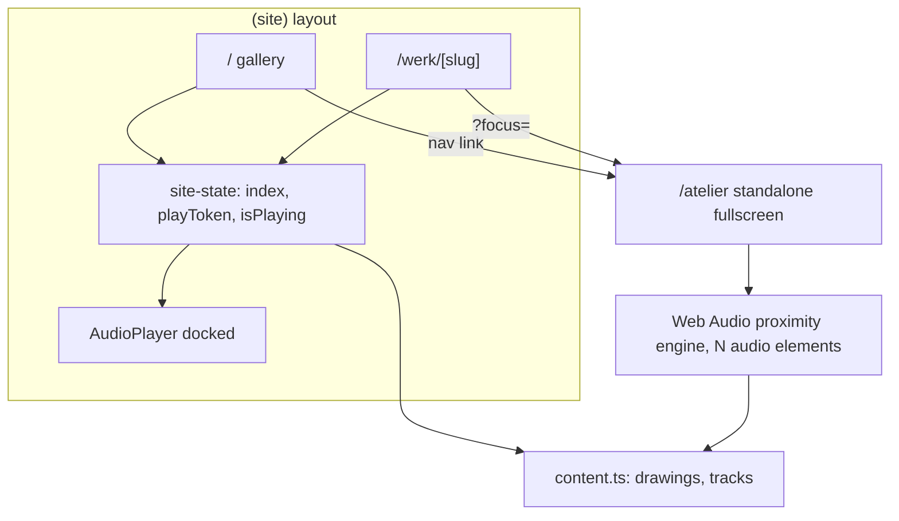

# Design: Integrating the Museum and Atelier views

Status: Accepted
Decision: Level 2 (unified shell + shared audio core), prioritising the "one site" feel
Last updated: 2026-06-23

Resolved sub-decisions (see "Resolved decisions" below):
1. Immersive-mode player: minimal "now near…" cue, auto-fading after inactivity.
2. Shared-element morph: only the focused piece on `werk ↔ atelier` (ship first; B later behind reduced-motion).
3. Keep Level 3 reachable: design view-agnostic seams.

## Context

The site presents one collection (`drawings` + `tracks` in
[`src/lib/content.ts`](../src/lib/content.ts)) through two very different views:

- **Museum (Galerij)** — a clean, paged gallery (`/` and `/werk/[slug]`) with a
  playlist-style audio player.
- **Atelier (Werktafel)** — a fullscreen, pan/zoom worktable where the same
  pieces are scattered and audio is spatial (proximity + zoom gated).

Today they are effectively two separate apps that only touch via navigation
links. This document plans how to integrate them so they feel like one room seen
two ways.

## Current architecture

| | Museum (Galerij) | Atelier |
|---|---|---|
| Route | `/` + `/werk/[slug]` inside the `(site)` group | `/atelier`, standalone, outside `(site)` |
| Chrome | Shared header (brand + nav) + docked player ([`(site)/+layout.svelte`](../src/routes/(site)/+layout.svelte)) | Fullscreen, immersive, only a "Galerij" back link |
| Audio model | **Playlist**: one track at a time, `index`/`playToken` in [`site-state.svelte.ts`](../src/lib/site-state.svelte.ts), single `<audio>` via [`AudioPlayer.svelte`](../src/lib/components/AudioPlayer.svelte), one-at-a-time enforced by [`audio-bus.ts`](../src/lib/components/audio-bus.ts) | **Spatial**: all tracks loaded at once, Web Audio graph with per-track gain + `StereoPanner`, proximity + zoom gating, no looping |
| Source data | `drawings` + `tracks` | same |
| Link between them | `werk → /atelier?focus=<id>` (one-way) | clicking a drawing zooms it (no link back to its detail) |



## Integration seams (what is siloed)

1. **Two audio engines, zero continuity.** Leaving the gallery while a track
   plays and entering the atelier hard-stops that audio; the atelier re-loads the
   same files into a different engine and starts silent. `site.isPlaying` is
   invisible to the atelier and vice versa. The same audio files are fetched by
   both stacks.
2. **Two chrome systems, hard page swaps.** The atelier lives outside the
   `(site)` layout group, so moving between views is a full layout teardown — no
   shared persistent player, no transition, no continuity of "place".
3. **One-way, shallow linking.** `werk → atelier?focus` works, but there is no
   atelier → `werk` path, and the gallery's track pills vs the atelier's table
   speakers are two separate UIs over the *same* tracks.
4. **Duplicated mental model.** Both are spatial presentations of one collection,
   but nothing makes them feel like the same room seen two ways.

## Goals and non-goals

**Goals**
- Make the two views feel like one site (shared shell + transitions). *Primary.*
- Continuous sound across views (no stop/restart, no double-load).
- Coherent navigation between a piece's gallery detail and its place on the table.

**Non-goals (for this iteration)**
- A full redesign into a single spatial canvas (tracked as Level 3 below).
- Changing the collection content or the visual identity of either view.

## Options considered

**Level 1 — Continuity glue** (low effort)
Persist `index`/`isPlaying` across views, hand audio off at the threshold, add an
atelier → `werk` link. Keeps two engines and two chromes. Cheap, but still feels
like two apps.

**Level 2 — Unified shell + shared audio core** (medium effort) — **chosen**
One audio engine with two renderers (playlist + spatial), the atelier under a
shared mode-aware layout, animated view transitions, bi-directional links. Feels
like one site with continuous sound.

**Level 3 — One spatial canvas** (high effort, future)
Treat the gallery and atelier as two zoom states of a single surface (the "clean
hang" vs the "working table") with an animated zoom between them. Maximum
integration, effectively a redesign. Kept as a north star, out of scope now.

## Chosen approach: Level 2

Phasing front-loads the visible "one site" feeling (the stated priority), then
continuity, then navigation polish. Level 1's glue is folded in as part of the
later phases rather than a throwaway step.

### Phase 1 — Shared shell

- Move [`src/routes/atelier/+page.svelte`](../src/routes/atelier/+page.svelte) to
  `src/routes/(site)/atelier/+page.svelte` (URL stays `/atelier`; route groups do
  not change paths).
- Make [`(site)/+layout.svelte`](../src/routes/(site)/+layout.svelte) mode-aware:
  `mode = isAtelier ? 'immersive' : 'paged'`.
  - `paged`: header (brand + Galerij/Atelier nav) + main padding + light bg (as today).
  - `immersive`: no header, no padding; the atelier's full-bleed container owns the
    screen; wrapper switches to `overflow:hidden` / `100svh` / dark.
- Render one **persistent player host** in the layout (survives navigation).
  `paged` = docked pill; `immersive` = hidden until the shared engine lands, then
  a minimal "now near…" cue that auto-fades after a few seconds of no interaction
  (resolved decision 1). Style it distinctly so it does not read as the museum's
  docked pill.
- **Keep Level 3 reachable (resolved decision 3):** treat the shell `mode` as a
  piece of state, not a hard route split, and keep piece geometry in a single
  source so a future single-canvas view can reuse it.

### Phase 2 — View transitions

- Drive the View Transitions API from `onNavigate` in the shared layout:
  ```ts
  onNavigate((nav) => {
    if (!document.startViewTransition || prefersReducedMotion()) return;
    return new Promise((resolve) => {
      document.startViewTransition(async () => { resolve(); await nav.complete; });
    });
  });
  ```
- Default crossfade via `::view-transition-old(root)/new(root)`; reduced-motion
  falls back to instant.
- **Shared-element morph (resolved decision 2):** when navigating between a
  piece's `werk/[slug]` detail and its atelier focus, tag *only that focused*
  drawing's `` with `view-transition-name: piece-<id>` on both ends so the
  plate visually flies between the wall and the table — the strongest "same
  collection" cue. Only the transitioning element may carry the name (names must
  be unique per snapshot). The "every drawing morphs" variant (Option B) is
  deferred until the shell is stable and would ship behind the same
  reduced-motion guard.

### Phase 3 — Shared audio core

- New `src/lib/audio-engine.svelte.ts` (strictly client-side; init in `onMount`):
  - One `AudioContext`; per track `MediaElementSource → GainNode → StereoPannerNode
    → destination`, owned by the engine via `new Audio(src)` objects (no DOM
    duplication; `createMediaElementSource` is once-per-element).
  - Single `unlock()` on the first user gesture anywhere (`resume()` + play/pause
    priming) — replaces the atelier's local unlock and the gallery's autoplay path.
  - `mode: 'playlist' | 'spatial'`, plus `index`, `isPlaying`.
  - **Playlist renderer** (gallery): selected track gain → 1 (others ramp to 0),
    pan 0; `play/toggle/next/prev`; auto-advance on `ended`.
  - **Spatial renderer** (atelier): keep the proximity + zoom-gate + pan-cap +
    no-loop math, writing to the engine's gains/panners.
  - **View-agnostic by design (resolved decision 3):** renderers are pluggable so
    a future Level 3 single-canvas view is an additional renderer, not a rewrite.
  - **Mode-switch crossfade:** entering the atelier while a gallery track plays
    keeps it audible and blends into proximity; leaving reverses it.
- Refactor consumers: [`site-state.svelte.ts`](../src/lib/site-state.svelte.ts)
  delegates playlist functions to the engine;
  [`AudioPlayer.svelte`](../src/lib/components/AudioPlayer.svelte) becomes a thin
  view over engine state; the atelier drops its private graph + `<audio>` elements.
  Delete [`audio-bus.ts`](../src/lib/components/audio-bus.ts) (the engine owns the
  mixing policy).
- The persistent player now reflects engine state in both modes.

### Phase 4 — Navigation coherence

- Atelier → `werk`: a subtle affordance on a focused drawing to open `/werk/[id]`
  (inverse of today's one-way `werk → ?focus`).
- Shared "current piece" state so context carries both directions.
- Optional: reconcile the gallery track pills and atelier table speakers as two
  presentations of the same `tracks`.

## Cross-cutting constraints and risks

- **Static / prerender.** The site is `prerender = true` on a static adapter, so
  the engine and View Transitions must be browser-only (guard with `onMount` /
  `document.startViewTransition` checks).
- **iOS autoplay.** Exactly one gesture-unlock at the engine level.
- **Preserve the atelier.** Immersive mode must not inherit the museum
  header/padding; keep the intro drift, keyboard nav, momentum, double-tap, and
  pan-cap behaviour.
- **Progressive enhancement.** No View Transitions support → plain navigation;
  reduced-motion → fades / instant.
- **Single-source-per-element.** `createMediaElementSource` can only run once per
  element, so the engine must own the audio elements for their lifetime.

## Verification

Each phase: `pnpm check` + `vite build`, plus a manual pass at desktop and
narrow/portrait widths. Specifically confirm: continuity of audio across
navigation, no double network fetch of audio files, smooth (and reduced-motion)
transitions, working `?focus=` deep-links round-trip, and that all atelier
gestures still work.

## Resolved decisions

Each decision below was made by choosing the recommended option; the trade-offs
are retained for posterity.

### 1. Persistent player in immersive (atelier) mode: visible cue or hidden?

**Resolved: Option A — a minimal "now near…" cue that auto-fades after a few
seconds of no interaction.** This keeps a consistent transport and reinforces the
spatial-audio concept while the auto-fade protects the immersive feel.


The shared layout renders one persistent player. In `paged` mode it is the docked
pill. In `immersive` mode we can either keep a minimal readout or hide it.

- **Option A — Minimal "now near…" cue (recommended).** A small, low-contrast
  label (and maybe a play/pause affordance) that names whatever the proximity mix
  currently favours.
  - Pros: reinforces the spatial-audio concept by *naming* what you hear;
    provides a consistent transport in both modes; gives a fallback control for
    users who do not realise the sound is proximity-driven.
  - Cons: adds chrome to a deliberately chrome-free space; "what is loudest" is a
    blend, so a single label can feel arbitrary near a boundary; needs its own
    styling so it does not read as the museum's docked pill.
- **Option B — Fully hidden.**
  - Pros: keeps the atelier pure and immersive; nothing competes with the table.
  - Cons: no continuity of the player UI across the threshold; no explicit
    transport in the atelier; weaker discoverability of "this is sound you move
    through".
- **Decision driver:** how much we trust proximity alone to communicate "this is
  audio". If discoverability worries us, lean A; if immersion is sacred, lean B.
  A middle path is A that auto-fades out after a few seconds of no interaction.

### 2. Shared-element morph: every drawing, or only the focused piece?

**Resolved: Option A — only the focused piece on `werk ↔ atelier`.** Ship the
legible, low-risk single-piece morph first; revisit Option B (whole-collection
morph) once the shell is stable, behind the same reduced-motion guard.

The Phase 2 enhancement assigns `view-transition-name` so a drawing visually
flies between the wall and the table.

- **Option A — Only the focused piece on `werk ↔ atelier` (recommended).** Tag
  just the one drawing involved in the deep-link.
  - Pros: a clear, legible "this exact piece moved" cue; names stay trivially
    unique (one per snapshot); cheap and low-risk; matches the existing
    `?focus=` flow.
  - Cons: the rest of the screen just crossfades, so the effect is localised.
- **Option B — Every drawing morphs (gallery grid ↔ atelier table).** Tag all
  pieces so the whole collection rearranges between layouts.
  - Pros: spectacular "same collection, two arrangements" moment; the strongest
    possible integration cue; pushes toward the Level 3 feel.
  - Cons: every piece needs a unique, stable `view-transition-name` present on
    *both* routes simultaneously; positions/sizes differ a lot, so morphs can look
    chaotic; heavier on lower-end devices; more fragile (a single duplicate or
    missing name breaks the whole transition); reduced-motion must cleanly skip
    all of it.
- **Decision driver:** appetite for spectacle vs robustness. Recommend shipping A
  first, then trialling B behind the same reduced-motion guard once the shell is
  stable.

### 3. Optimise purely for Level 2, or keep room for Level 3?

**Resolved: Option A — design seams that keep Level 3 reachable.** Keep the audio
engine view-agnostic (pluggable renderers), keep piece geometry in one place, and
treat the shell mode as state rather than a hard route split, so Level 3 is
additive later rather than a rewrite.

Level 3 (a single spatial canvas where gallery and atelier are zoom states of one
surface) is out of scope now, but the Phase 1 shell and Phase 3 engine are where
we either leave the door open or close it.

- **Option A — Design seams that keep Level 3 reachable (recommended).** Keep the
  audio engine view-agnostic (renderers are pluggable), keep piece geometry in one
  place, and keep the shell mode a piece of state rather than a hard route split.
  - Pros: Level 3 becomes an additive renderer/route later, not a rewrite; the
    abstractions (engine, mode-aware layout) are reusable; little extra cost if
    done while we are already touching these files.
  - Cons: slightly more upfront abstraction than Level 2 strictly needs; risk of
    over-engineering for a direction we may never take.
- **Option B — Optimise narrowly for Level 2.** Build the simplest shell/engine
  that satisfies Phases 1–4.
  - Pros: least code, fastest to ship, easiest to reason about.
  - Cons: a future Level 3 likely means reworking the layout/route split and the
    audio ownership model.
- **Decision driver:** how likely Level 3 is. Given it is explicitly the stated
  north star, the cheap insurance of Option A (mostly just "don't hard-code the
  view into the engine") is worth taking.
